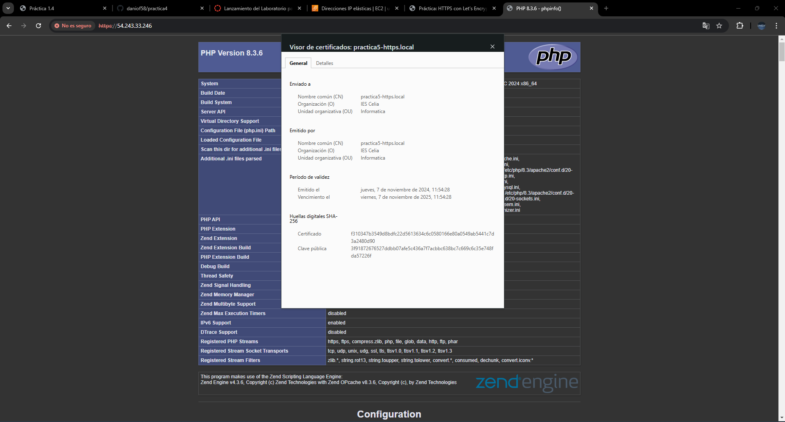

# Practica 4
# Creación y Configuración de un Certificado SSL/TLS Autofirmado en Apache
Vamos a describir el proceso para crear un certificado SSL/TLS autofirmado con `OpenSSL` y configurarlo en un servidor Apache
## Estructura de nuestro repositorio

``` bash
.
├── README.md
├── conf
│   ├── 000-default.conf
│   └── default-ssl.conf
├── php
│   └── index.php
├── scripts
│   ├── .env
│   ├── install_lamp.sh
│   └── setup_selfsigned_certificate.sh
└── .gitignore

 ```

## Guia install_lamp.sh

```bash
#!/bin/bash

# Muestra cada comando y notifica si ocurre un error
set -ex

# Actualización de los repositorios
apt update

# Actualización de los paquetes
apt upgrade -y

# Instalación de Apache
apt install apache2 -y

# Eliminación de paquetes innecesarios
apt purge

# Habilitación del módulo rewrite de Apache
a2enmod rewrite

# Copia del archivo de configuración personalizado de Apache
cp ../conf/000-default.conf /etc/apache2/sites-available

# Instalación de PHP y módulos para Apache y MySQL
apt install php libapache2-mod-php php-mysql -y

# Reinicio del servicio de Apache
systemctl restart apache2

# Instalación de MySQL
apt install mysql-server -y

# Copia del archivo de prueba PHP a la carpeta de Apache
cp ../php/index.php /var/www/html

# Cambio de propietario y grupo para el archivo index.php
chown -R www-data:www-data /var/www/html
``` 

## Guia setup_selfsigned_certificate.sh

``` bash
#!/bin/bash

# Importamos las variables del archivo .env
source .env

# Modo de depuración
set -ex

# Crear el certificado SSL/TLS autofirmado
sudo openssl req \
  -x509 \
  -nodes \
  -days 365 \
  -newkey rsa:2048 \
  -keyout /etc/ssl/private/apache-selfsigned.key \
  -out /etc/ssl/certs/apache-selfsigned.crt \
  -subj "/C=$OPENSSL_COUNTRY/ST=$OPENSSL_PROVINCE/L=$OPENSSL_LOCALITY/O=$OPENSSL_ORGANIZATION/OU=$OPENSSL_ORGUNIT/CN=$OPENSSL_COMMON_NAME/emailAddress=$OPENSSL_EMAIL"

# Copiar archivo de configuración SSL para Apache
cp ../conf/default-ssl.conf /etc/apache2/sites-available

# Habilitar el sitio SSL en Apache
sudo a2ensite default-ssl.conf

# Habilitar el módulo SSL en Apache
sudo a2enmod ssl

# Copiar archivo de configuración HTTP para Apache
cp ../conf/000-default.conf /etc/apache2/sites-available

# Habilitar el sitio HTTP en Apache
a2ensite 000-default.conf

# Habilitar módulo de reescritura en Apache
sudo a2enmod rewrite

# Reiniciar Apache para aplicar cambios
systemctl restart apache2
```

## Guia .env

``` bash
# Configuración de la contraseña para el usuario de phpMyAdmin
PHPMYADMIN_APP_PASSWORD=usuario

# Usuario de la base de datos MySQL
DB_USER=usuario

# Contraseña para el usuario de la base de datos MySQL
DB_PASSWORD=usuario

# Nombre de la base de datos en MySQL
DB_NAME=basededatos

# Configuración del Certificado SSL/TLS

# País donde se emite el certificado 
OPENSSL_COUNTRY="ES"

# Provincia o región en la que se emite el certificado
OPENSSL_PROVINCE="Almeria"

# Localidad o ciudad de la organización que emite el certificado
OPENSSL_LOCALITY="Maria"

# Nombre de la organización que emite el certificado
OPENSSL_ORGANIZATION="IES Celia"

# Unidad organizativa o departamento de la organización
OPENSSL_ORGUNIT="Informatica"

# Nombre del certificado 
OPENSSL_COMMON_NAME="practica5-https.local"

# Correo electrónico asociado con el certificado
OPENSSL_EMAIL="dani@iescelia.org"

```

## Guia del 000-default.conf
``` bash
<VirtualHost *:80>
    #ServerName www.example.com
    ServerAdmin webmaster@localhost
    DocumentRoot /var/www/html/

    DirectoryIndex index.php index.html

    ErrorLog ${APACHE_LOG_DIR}/error.log
    CustomLog ${APACHE_LOG_DIR}/access.log combined
</VirtualHost>
```

## Guia del delfault-ssl.conf

``` bash
<VirtualHost *:443>
   
    # ServerName practica-https.local

    # Directorio raíz 
    DocumentRoot /var/www/html

    # Definir los archivos por defecto 
    DirectoryIndex index.php index.html

    # Habilitar SSL para este VirtualHost
    SSLEngine on

    # Ruta al certificado SSL autofirmado
    SSLCertificateFile /etc/ssl/certs/apache-selfsigned.crt

    # Ruta a la clave privada del certificado SSL autofirmado
    SSLCertificateKeyFile /etc/ssl/private/apache-selfsigned.key
</VirtualHost>
```

## Explicación de funciones
### setup_selfsigned_certificate.sh: 
Crea un certificado SSL/TLS autofirmado y configura Apache para usar HTTPS
### install_lamp.sh:
Instala y configura el servidor LAMP en el sistema
### index.php: 
Archivo PHP de prueba para mostrar en el servidor Apache
### 000-default.conf: 
Configuración del servidor Apache 
### default-ssl.conf: 
Configuración de Apache para el servidor HTTPS habilitando SSL con el certificado autofirmado
### .env:
 Archivo de variables de entorno contiene credenciales de la base de datos y configuraciones para el certificado SSL

 # Comprobación
 

 